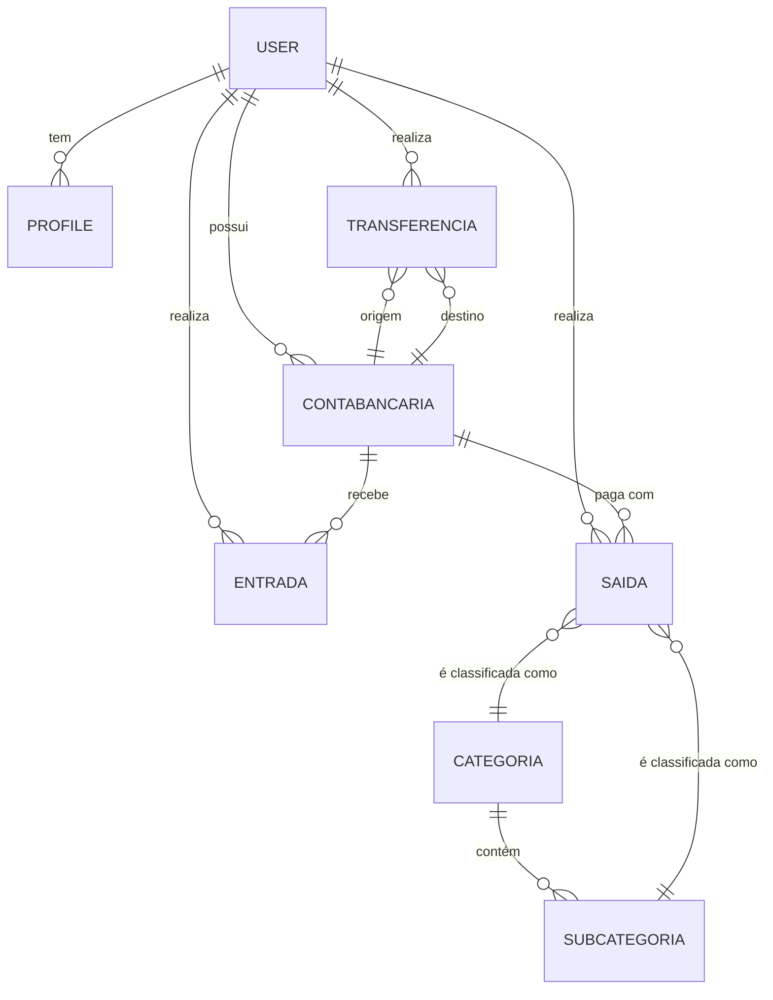

# Modelos de Dados e Relacionamentos

Os modelos de dados são a espinha dorsal do sistema, definindo a estrutura do banco de dados. Eles estão localizados em `core/models.py`.

### Principais Modelos

- **`User` (Nativo do Django)**: O modelo de usuário padrão do Django.
- **`Profile`**: Extensão do `User` com uma relação `OneToOneField`. Adiciona campos como `foto_perfil` e `theme`.
- **`ContaBancaria`**: Representa uma conta do usuário (corrente, poupança, cartão). É a entidade central para transações.
- **`Entrada`**: Modela uma receita, associada a um `User` e a uma `ContaBancaria`.
- **`Saida`**: Modela uma despesa. É mais complexo, incluindo campos para parcelamento, recorrência e status de pagamento. Também associado a um `User` e a uma `ContaBancaria`.
- **`Transferencia`**: Modela a transferência de valor entre duas `ContaBancaria`.
- **`Categoria` / `Subcategoria`**: Permitem a organização hierárquica das despesas.
- **`Lembrete`**: Um modelo simples para agendar lembretes financeiros.
- **`OperacaoSaque`**: Para rastrear operações de crédito/empréstimo.

### Diagrama de Relacionamento (Simplificado)

### Validações e Lógica de Negócio

Muitos modelos contêm lógica importante nos seus métodos `clean()` e `save()`.

- **`ContaBancaria.clean()`**: Valida que contas do tipo 'corrente' ou 'poupanca' devem ter agência e número de conta.
- **`Saida.clean()`**: Impõe regras de negócio, como: o valor das parcelas somado não pode divergir do valor total, e pagamentos parcelados não podem ser recorrentes.
- **`Transferencia.save()`**: Garante que, ao criar uma nova transferência, os saldos das contas de origem e destino sejam atualizados atomicamente. Este método é o núcleo da consistência de saldos em transferências.
