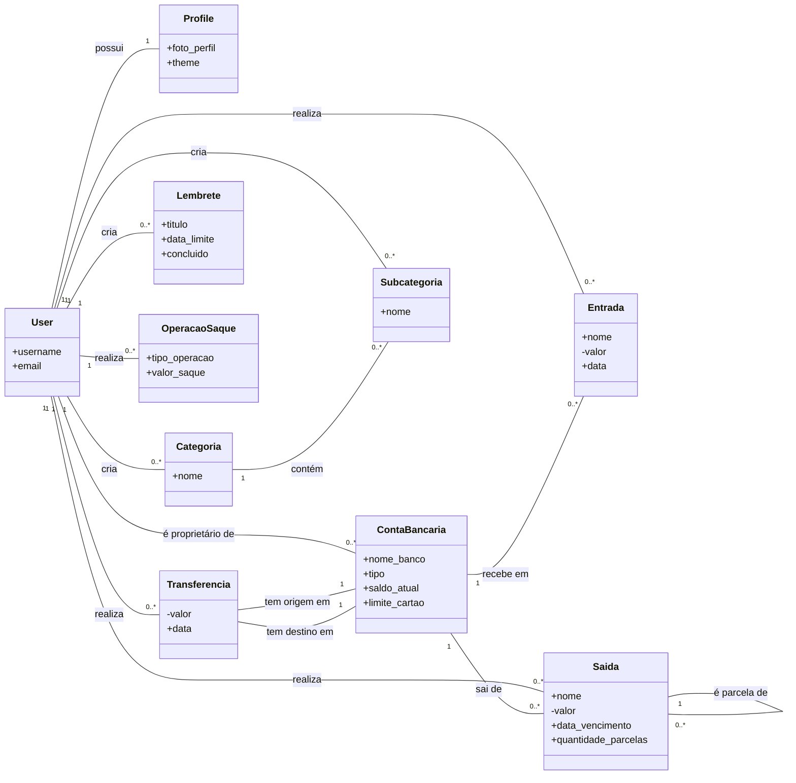

# Modelagem de Dados

Esta seção detalha a estrutura do banco de dados, os modelos do Django e os relacionamentos entre as entidades do sistema FinanceFlow.

## Diagrama de Classes Principal

O diagrama a seguir ilustra as principais entidades do sistema e como elas se interconectam. Ele foi gerado a partir dos modelos definidos em `core/models.py`.

