# 📊 Exemplos de Diagramas de Fluxo para Documentação

## 1. DIAGRAMA DE ARQUITETURA DO SISTEMA

```mermaid
graph TB
    subgraph "Usuário"
        U[👤 Usuário]
    end

    subgraph "Frontend (Servido pelo Django)"
        B[🌐 Browser]
        T[📄 Django Templates]
        S[🎨 Tailwind CSS]
    end

    subgraph "Backend (Aplicação Django)"
        D[🐍 Django Core]
        API[🛡️ Django REST Framework]
        DB[🗄️ Database (PostgreSQL/SQLite)]
        C[📊 Redis (Cache)]
    end

    subgraph "Plataforma & CI/CD"
        GH[🐙 GitHub] --> GHA[🤖 GitHub Actions]
        GHA --> R[☁️ Render (Hospedagem)]
    end

    subgraph "Serviços Externos"
        Email[📧 Email Service]
        Sentry[🚨 Sentry (Error Monitoring)]
        PDF[📄 PDF Generation]
    end

    %% Conexões
    U --> B
    B <--> T
    T --> S
    T <--> D

    D <--> DB
    D <--> C
    D <--> API
    API <--> DB

    D --> Email
    D --> Sentry
    D --> PDF

    R --> D

    %% Estilos
    style D fill:#f3e5f5
    style DB fill:#e8f5e8
    style R fill:#cceeff
```

## 2. FLUXO DE AUTENTICAÇÃO

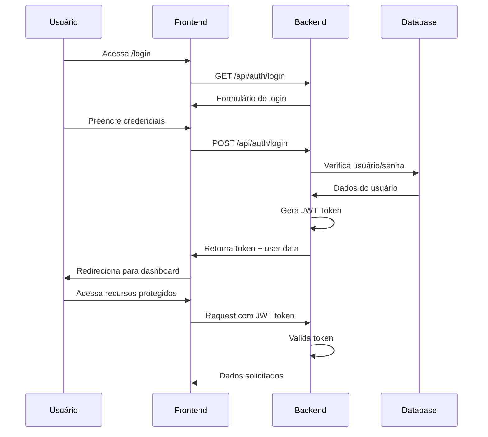

## 3. FLUXO DE UMA TRANSFERÊNCIA

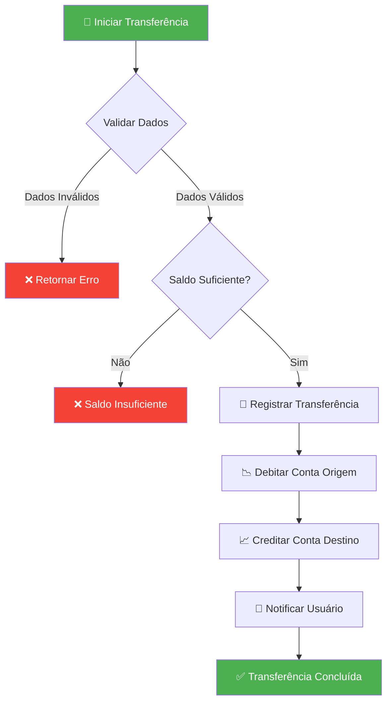

## 4. FLUXO DO DASHBOARD

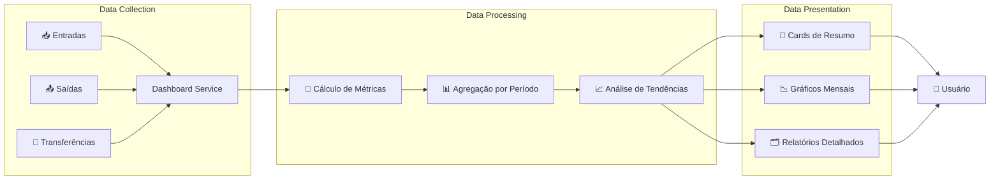

## 5. SISTEMA DE CATEGORIAS E SUBCATEGORIAS

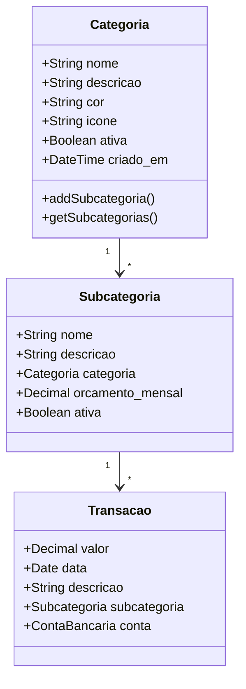

## 6. FLUXO DE DEPLOY NO RENDER

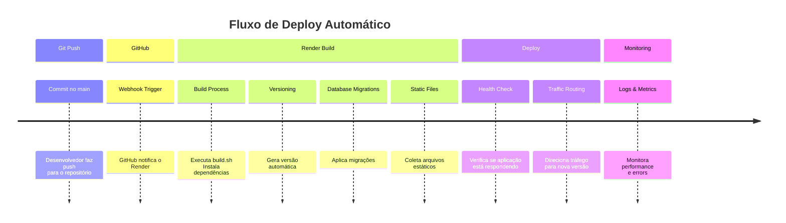

## 7. SISTEMA DE PARCELAMENTO

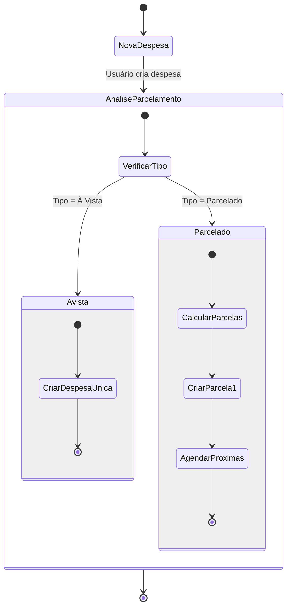

## 8. FLUXO DE GERACAO DE RELATÓRIOS

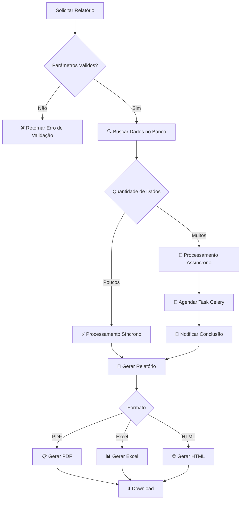

## 9. ARQUITETURA DE BANCO DE DADOS (SIMPLIFICADA)

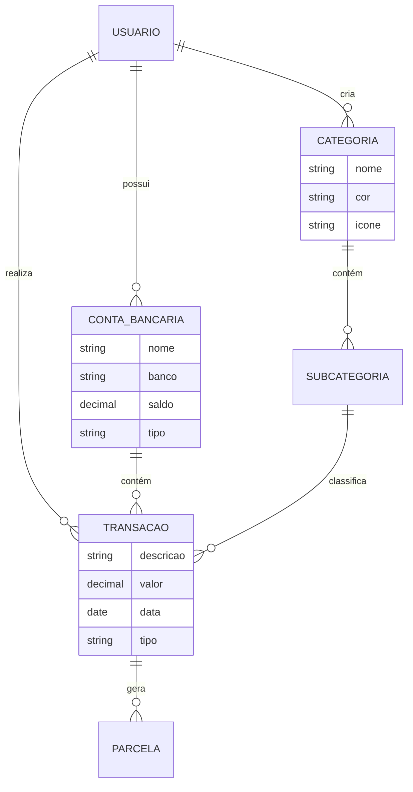

## 10. FLUXO DE RECUPERAÇÃO DE SENHA

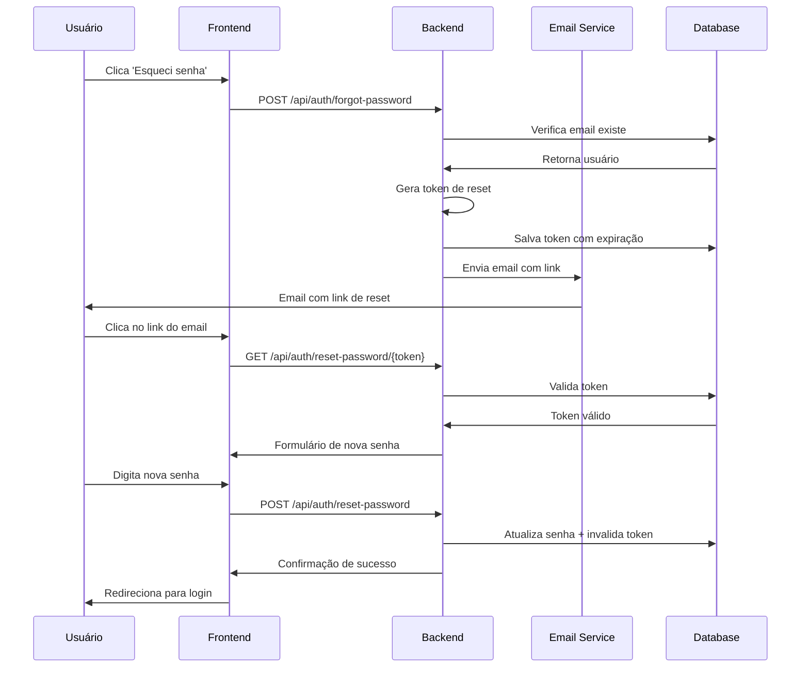

## 11. SISTEMA DE CACHE

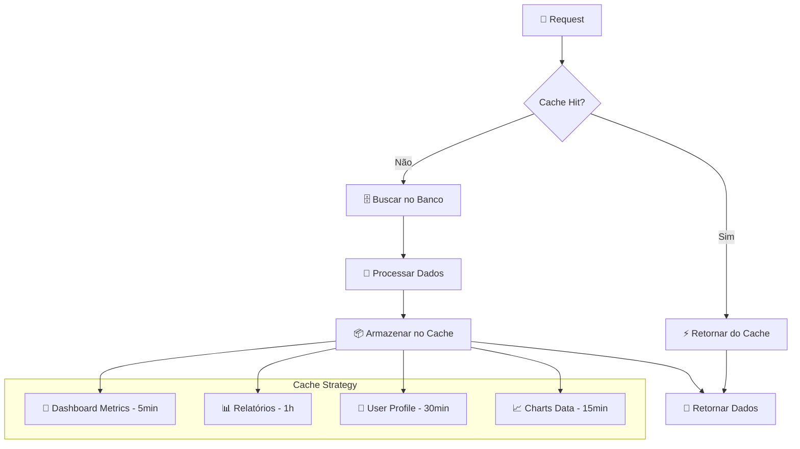

## 12. FLUXO DE CODE REVIEW

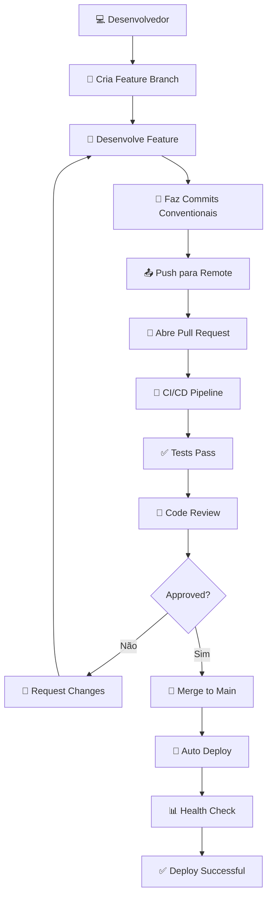

## 13. ESTRUTURA DE PASTAS DO PROJETO

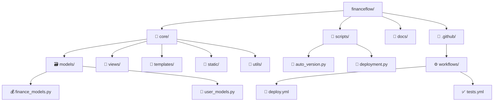

## 14. FLUXO DE NOTIFICAÇÕES

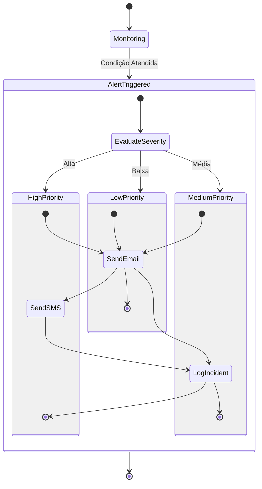

## 15. DIAGRAMA DE COMPONENTES FRONTEND

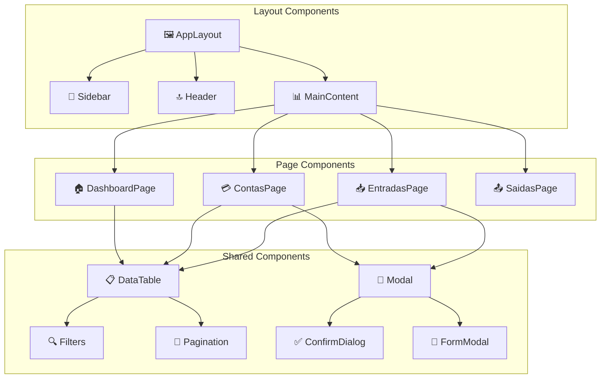
